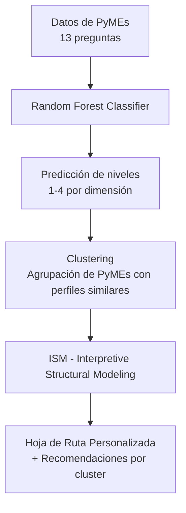

# Evaluador de Madurez Industria 4.0 para PyMEs Ecuatorianas

**Prototipo Final - Trabajo de Titulación**

## Descripción del Proyecto

Este sistema permite evaluar el nivel de madurez en **Industria 4.0** de una PyME ecuatoriana a través de 13 preguntas distribuidas en tres dimensiones: **Tecnología**, **Producto** y **Cliente**.

El prototipo entrega un diagnóstico preciso y una **hoja de ruta personalizada** con recomendaciones accionables.

### Pipeline del Sistema



## Flujo principal:

1. Random Forest → Predice el nivel de madurez en cada dimensión y calcula un nivel final ponderado (40% Tecnología + 35% Producto + 25% Cliente).
2. Clustering → Agrupa las PyMEs según su perfil de madurez similar para ofrecer recomendaciones más precisas por grupo.
3. ISM (Interpretive Structural Modeling) → Genera una hoja de ruta jerárquica con niveles recomendados, prioridades y variables driver (las más influyentes para avanzar).

## Objetivo
Proporcionar a las PyMEs ecuatorianas un diagnóstico rápido, interpretable y accionable para guiar su transformación digital hacia la Industria 4.0.

## Características Principales

- Predicción de madurez por dimensión y nivel global ponderado
- Agrupación de PyMEs mediante Clustering
- Hoja de ruta ISM con niveles jerárquicos y drivers clave
- Generación automática de reporte PDF profesional (resultados + gráficos + recomendaciones)
- Interfaz simple por consola
- Código modular, limpio y reproducible

Estructura del Proyecto
```text
1_TESIS_IA_UDLA/
├── main.py                          # Script principal
├── rf_madurez.py                    # Modelo Random Forest
├── ism_roadmap.py                   # Módulo ISM + generación de PDF
├── MODELS/
│   └── rf_madurez_models.joblib     # Modelo entrenado
├── OUTPUTS/                         # Resultados generados (CSV y PDF)
├── NOTEBOOKS/
│   └── Recomendacion.ipynb          # Clustering, desarrollo y validación
├── requirements.txt
└── README.md
```

## Requisitos Técnicos

- Python 3.10+
- Google Colab (recomendado) o entorno local

## Dependencias (`requirements.txt`)

```bash
pandas>=2.1.0
numpy>=1.24.0
scikit-learn>=1.3.0
joblib>=1.3.2
matplotlib>=3.7.0
networkx>=3.1
```
# Instrucciones de Ejecución
## En Google Colab (Recomendado)
1. Abre el proyecto en Google Colab
2. Monta tu Google Drive
3. Ejecuta el siguiente comando en una celda:
```bash
!python main.py
```
4. Elige una opción:
- 1 → Ingresar respuestas manualmente
- 2 → Usar ejemplo de prueba

## En entorno local
```bash
pip install -r requirements.txt
python main.py
```
## Salida del Sistema
Al ejecutar el prototipo se genera automáticamente:
- Consola: Resultados de madurez + hoja de ruta textual
- Archivos en carpeta OUTPUTS/:
    - diagnostico_YYYYMMDD_HHMMSS.csv
    - diagnostico_YYYYMMDD_HHMMSS.pdf ← Reporte completo con gráficos ISM y recomendaciones


## Tecnologías Utilizadas

- Machine Learning: Random Forest (scikit-learn)
- Clustering: Agrupación de PyMEs por perfil de madurez
- Modelado Estructural: Interpretive Structural Modeling (ISM)
- Visualización: Matplotlib + NetworkX
- Reportes: PDF profesional

## Validación Técnica
- Modelo entrenado con 276 respuestas reales de PyMEs ecuatorianas
- Validación cruzada y métricas de desempeño disponibles en NOTEBOOKS/Recomendacion.ipynb
- ISM implementado con matriz SSIM → IRM → FRM → Level Partitioning
- Clustering aplicado para agrupar perfiles similares


## Autores:
José Toscano

Sylvia Novillo

Pablo Novillo

Trabajo de Titulación - Ingeniería en Inteligencia Artificial

Universidad de las Américas (UDLA)

Quito, Ecuador - 2026
