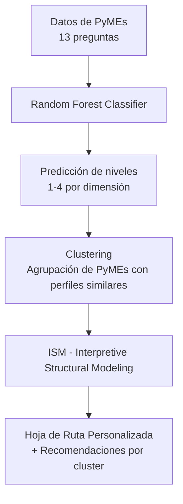

# Evaluador de Madurez Industria 4.0 para PyMEs Ecuatorianas

**Prototipo Final - Trabajo de Titulación**

## Descripción del Proyecto

Este sistema permite evaluar el nivel de madurez en **Industria 4.0** de una PyME ecuatoriana a través de 13 preguntas distribuidas en tres dimensiones: **Tecnología**, **Producto** y **Cliente**.

El prototipo entrega un diagnóstico preciso y una **hoja de ruta personalizada** con recomendaciones accionables.

### Pipeline del Sistema



## Flujo principal:

1. Random Forest → Predice el nivel de madurez en cada dimensión y calcula un nivel final ponderado (40% Tecnología + 35% Producto + 25% Cliente).
2. Clustering → Agrupa las PyMEs según su perfil de madurez en 5 clusters con nombres descriptivos:
- Básicos con Déficit Tecnológico
- Intermedios con Fuerte Producto
- Intermedios Equilibrados
- Orientados al Cliente
- Iniciales / Estancados
3. ISM (Interpretive Structural Modeling) → Genera una hoja de ruta jerárquica con niveles recomendados, prioridades y variables driver (las más influyentes para avanzar).

## Objetivo
Proporcionar a las PyMEs ecuatorianas un diagnóstico rápido, interpretable y accionable para guiar su transformación digital hacia la Industria 4.0.

## Características Principales

- Predicción de madurez por dimensión y nivel global ponderado
- Análisis por Clúster con nombre descriptivo
- Hoja de ruta ISM con niveles jerárquicos y drivers clave
- Generación automática de reporte PDF profesional (resultados + gráficos + recomendaciones)
- Interfaz simple por consola
- Código modular, limpio y reproducible

Estructura del Proyecto
```text
1_TESIS_IA_UDLA/
├── main.py                          # Script principal
├── rf_madurez.py                    # Modelo Random Forest
├── ism_roadmap.py                   # Módulo ISM + generación de PDF
├── clustering_utils.py              # Carga y predicción de clúster
├── MODELS/
│   └── clustering_model.joblib      # Modelo KMeans + Scaler
├── OUTPUTS/                         # Resultados generados (CSV y PDF)
├── requirements.txt
└── README.md
```

## Requisitos Técnicos

- Python 3.10+
- Google Colab (recomendado) o entorno local

## Dependencias (`requirements.txt`)

```bash
pandas>=2.1.0
numpy>=1.24.0
scikit-learn>=1.3.0
joblib>=1.3.2
matplotlib>=3.7.0
networkx>=3.1
```
# Instrucciones de Ejecución
## En Google Colab (Recomendado)
1. Abre el proyecto en Google Colab
2. Monta tu Google Drive
3. Ejecuta el siguiente comando en una celda:
```bash
!python main.py
```
4. Elige una opción:
- 1 → Ingresar respuestas manualmente
- 2 → Usar ejemplo de prueba

## En entorno local
```bash
pip install -r requirements.txt
python main.py
```
## Salida del Sistema
Al ejecutar el prototipo se genera automáticamente:
- Consola:
    - Resultados de madurez (Random Forest)
    - Nombre del clúster al que pertenece la PyME
    - Hoja de ruta textual ISM
- Archivos en generados en carpeta OUTPUTS/:
    - diagnostico_YYYYMMDD_HHMMSS.csv
    - diagnostico_YYYYMMDD_HHMMSS.pdf ← Reporte completo con gráficos ISM y recomendaciones
        - Portada con resultados RF
        - Análisis por Clúster (nuevo)
        - 3 Diagramas ISM jerárquicos
        - Hoja de ruta detallada con recomendaciones


## Tecnologías Utilizadas

Machine Learning: Random Forest (scikit-learn)
Clustering: KMeans + StandardScaler (5 clusters)
Modelado Estructural: Interpretive Structural Modeling (ISM)
Visualización: Matplotlib + NetworkX
Reportes: PDF con matplotlib.backends.backend_pdf

## Clusters Definidos

El sistema agrupa las PyMEs en **5 clusters** según su perfil de madurez:

| Cluster ID | Nombre del Clúster                        | Característica principal                          |
|------------|-------------------------------------------|---------------------------------------------------|
| 0          | Básicos con Déficit Tecnológico           | Bajo nivel en Tecnología                          |
| 1          | Intermedios con Fuerte Producto           | Fuerte en la dimensión Producto                   |
| 2          | Intermedios Equilibrados                  | Niveles intermedios y balanceados                 |
| 3          | Orientados al Cliente                     | Mejor desempeño en la dimensión Cliente           |
| 4          | Iniciales / Estancados                    | Niveles bajos en las tres dimensiones             |


## Validación Técnica

### Random Forest
- Se entrenó y evaluó utilizando **validación cruzada**.
- Métrica principal: **Macro F1-score** (elegida por el desbalanceo entre clases).
- Otras métricas: Weighted F1-score y Accuracy.
- Se analizó la **matriz de confusión** para revisar errores de clasificación entre niveles.

### Clustering (KMeans)
- Se aplicó KMeans con 5 clusters sobre los niveles predichos de las tres dimensiones.
- Se evaluó la calidad del clustering mediante:
  - Silhouette Score
  - Davies-Bouldin Index
  - Calinski-Harabasz Index

### ISM (Interpretive Structural Modeling)
- Implementado con la metodología estándar: SSIM → Initial Reachability Matrix → Final Reachability Matrix → Level Partitioning.
- Generación de diagramas jerárquicos y hoja de ruta con variables driver.

Todo el pipeline fue validado con **276 respuestas reales** de PyMEs ecuatorianas.


## Autores:
José Toscano

Sylvia Novillo

Pablo Novillo

Trabajo de Titulación - Maestría en Inteligencia Artificial

Universidad de las Américas (UDLA)

Quito, Ecuador - 2026
