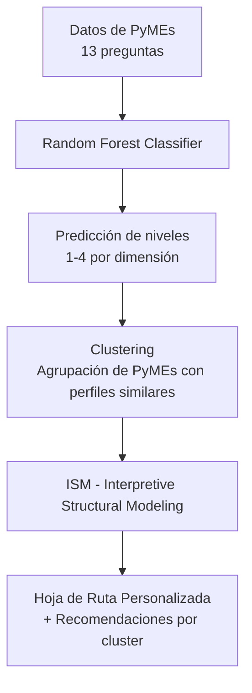

# Reflexión Final - Trabajo de Titulación

**Autores:**  
Novillo Villegas Sylvia  
Novillo Villegas Pablo  
Toscano Romero José  

**Carrera:** Maestría en Inteligencia Artificial  
**Universidad:** Universidad de las Américas (UDLA)  
**Fecha:** Abril 2026

## Introducción

El prototipo "Evaluador de Madurez Industria 4.0 para PyMEs Ecuatorianas" fue desarrollado como trabajo de titulación con el objetivo de ofrecer una herramienta que combine diagnóstico predictivo y recomendaciones estratégicas para apoyar la transformación digital de las pequeñas y medianas empresas del Ecuador.

## Pipeline del Sistema y Logros Principales

El sistema implementa un pipeline completo que integra tres etapas principales:

El sistema sigue el siguiente flujo integrado:

Este pipeline combina técnicas de aprendizaje supervisado, no supervisado y modelado estructural para entregar un resultado completo y accionable.

1. **Random Forest Classifier**: Predice el nivel de madurez (1-4) en las dimensiones de Tecnología, Producto y Cliente, y calcula un nivel final ponderado.
2. **Clustering (K-Means con n=4)**: Agrupa las PyMEs según su perfil de madurez digital similar.
3. **Interpretive Structural Modeling (ISM)**: Genera una hoja de ruta jerárquica personalizada con prioridades y variables driver.

Entre los principales logros destacan:
- Implementación funcional de los tres módulos y su integración en un flujo automatizado.
- Generación automática de reportes PDF que incluyen resultados, diagramas ISM y recomendaciones.
- Análisis de clusters que permitió identificar cuatro perfiles distintos de madurez digital entre 276 PyMEs analizadas.

## Análisis de Clusters de Madurez Digital

Mediante la combinación de Random Forest y K-Means (n=4), se identificaron cuatro perfiles de madurez digital. La siguiente tabla resume los promedios por dimensión y el tamaño de cada cluster:

**Tabla: Perfiles de madurez digital identificados mediante clustering**

| Cluster | Nombre del Cluster              | Tecnología | Producto | Cliente | Nº de PyMEs | % del total |
|---------|----------------------------------|------------|----------|---------|-------------|-------------|
| 0       | Orientados al Cliente            | 1.87       | 1.84     | 3.37    | 67          | 24.3%       |
| 1       | Equilibrados Intermedios         | 3.02       | 2.77     | 2.79    | 53          | 19.2%       |
| 2       | Nivel Inicial / Estancados       | 1.81       | 1.78     | 1.71    | 69          | 25.0%       |
| 3       | Innovadores en Producto          | 1.91       | 3.23     | 2.31    | 87          | 31.5%       |

**Interpretación de los clusters:**

- **Cluster 0 (Orientados al Cliente)**: Muestran fortaleza en la dimensión Cliente, pero presentan rezagos importantes en Tecnología y Producto.
- **Cluster 1 (Equilibrados Intermedios)**: Representa el grupo más balanceado y con mayor potencial de avance sostenido.
- **Cluster 2 (Nivel Inicial / Estancados)**: Grupo con menor madurez digital, que requiere intervención prioritaria y acompañamiento básico.
- **Cluster 3 (Innovadores en Producto)**: El cluster más numeroso. Destacan en la dimensión Producto, pero carecen de una base tecnológica sólida.

Estos resultados evidencian que la transformación digital en las PyMEs analizadas ha sido desigual, con solo el 19,2% presentando un desarrollo armónico.

## Resultados del Modelo Random Forest

El modelo Random Forest mostró un desempeño sólido, destacando especialmente en la predicción del nivel final:

- **Nivel Final**: Macro F1 = 0.952 | Accuracy = 0.911
- **Dimensión Tecnología**: Macro F1 = 0.837
- **Dimensión Producto**: Macro F1 = 0.711
- **Dimensión Cliente**: Macro F1 = 0.735

Estas métricas confirman la capacidad del modelo para clasificar correctamente los niveles de madurez, siendo la predicción del nivel global la de mejor rendimiento.

## Dificultades Encontradas y Soluciones

Durante el desarrollo se enfrentaron desafíos relacionados con la integración entre módulos, la correcta visualización y exportación de diagramas ISM en PDF, y el control del formato en los reportes generados. Estos problemas fueron resueltos mediante ajustes en la generación de figuras, el uso de `PdfPages` y la optimización del espaciado en Matplotlib.

## Incorporación de Retroalimentación

El equipo incorporó las observaciones recibidas a lo largo del curso, incluyendo la mejora en la modularidad del código, la inclusión explícita del pipeline completo y el fortalecimiento de la documentación técnica.

## Limitaciones y Mejoras Futuras

Entre las principales limitaciones se encuentran la integración aún parcial del módulo de Clustering para recomendaciones automáticas por grupo y el tamaño de la base de datos de entrenamiento. 

Como mejoras futuras se propone:
- Completar la integración del Clustering con recomendaciones específicas por perfil.
- Ampliar la base de datos con más respuestas de PyMEs ecuatorianas.
- Desarrollar una interfaz web para facilitar el uso del prototipo.
- Incorporar técnicas de explicabilidad del modelo.

## Conclusión

El desarrollo de este prototipo permitió al equipo aplicar de manera integrada herramientas de inteligencia artificial para resolver un problema real del sector productivo nacional. El resultado obtenido demuestra un nivel técnico aceptable y una herramienta de valor práctico para las PyMEs ecuatorianas.

El proceso fortaleció las competencias de los autores en diseño, implementación y documentación de soluciones basadas en IA, sentando una base sólida para futuros desarrollos.

---

**Fecha:** Abril 2026
